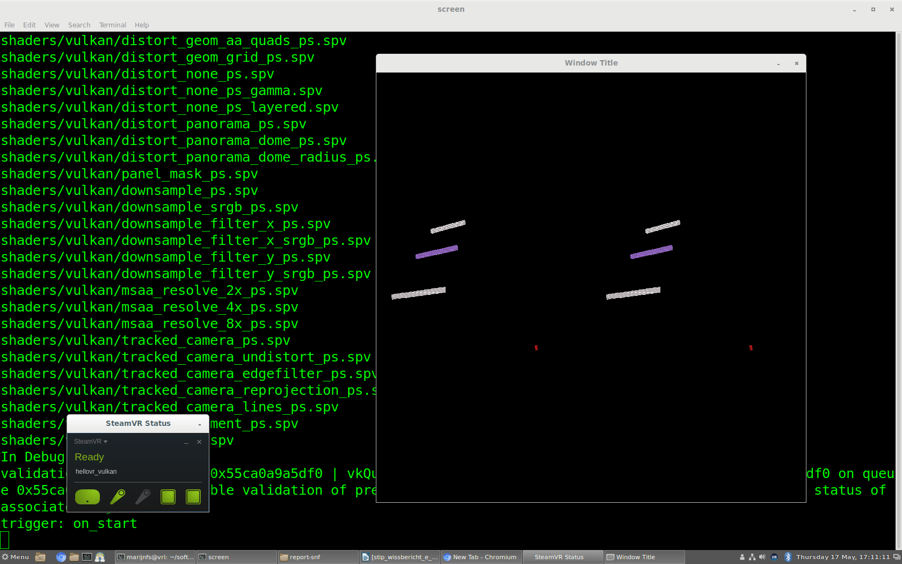
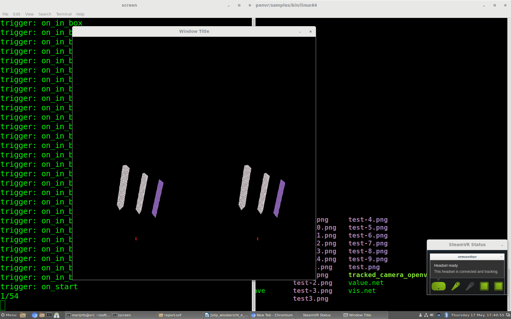

The Virtual Reality Learning System (VRL)
===================
    
Code in this directory developed by Marijn Stollenga

Licensed under Mozilla Public License Version 2.0 (See LICENSE file)

This work was sponsored by the Swiss National Science Foundation (SNF) under project number P2TIP1-165175.

Reorganised version of original openvr based repository: 496d1a3af51333f1e00635b2a8e9fa7450e09cdd
    